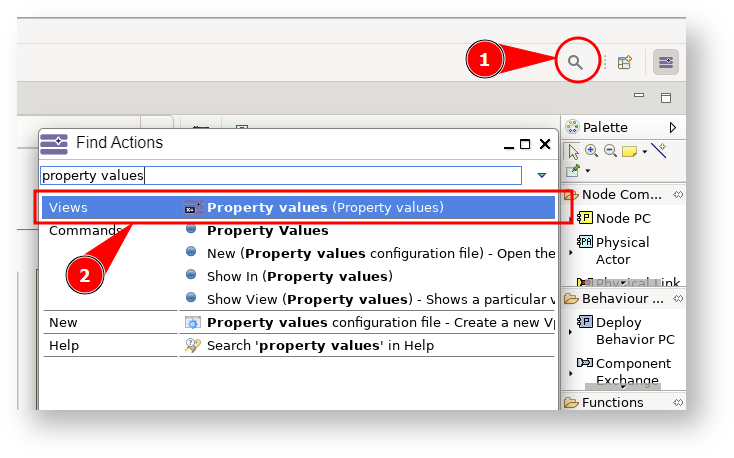
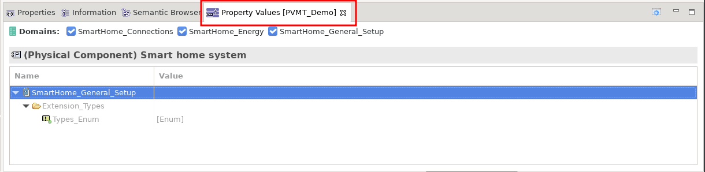
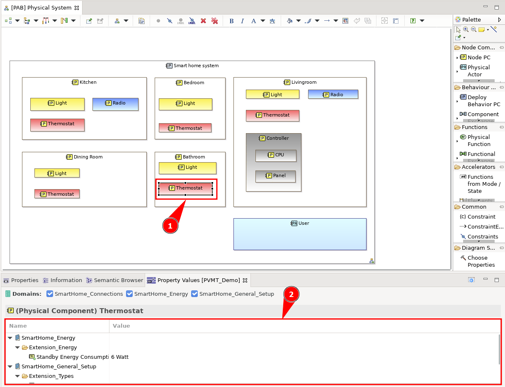

# Part 1: Introduction

_To start really simple, lets think about the following situation_: You are the owner of a house and you are trying to set up a smart home automation system. The system consists of intelligent lights that shall be centrally controlled, automatically switched on and off or adjusted in brightness; thermostats that control room temperature and adjust heating or cooling based on preset temperature targets; security cameras that shall monitor the home, trigger alarms or record when motion is detected; and automated windows and doors that shall be opened and closed remotely or automatically based on weather conditions or security requirements.

To support your development and architecture decisions you have build a Capella MBSE model and already included a configuration for the property value management tool (PVMT) extension. So, everything is already preset for this task. We show the advantages of PVMT using just the example of physical architecture. However, the procedure can generally be applied to all layers and model elements. And, don't worry, we will later learn step-by-step how to set up and configure all of this.

Now, open the existing Capella model for the smart home system. Take some time to explore and get comfortable with the model. Open the physical architecture overview to see how the system is structured.

Next, let's dive into the Property Values view and get familiar with it! Here's how you can open it:

- Click on the search icon (<CaIcon name="search"/>) at the top of your interface (1).
- Type "Property Values" into the search bar.
- Select the Property Values tab (2) from the results (as shown in the image below).

Once you've followed these steps, the Property Values view (<CaIcon name="propertyValues" />) will appear on your screen:

Initially, this view will be empty. But don't worry—start clicking around on different components, and you'll notice the magic! The individual properties and values for each component will automatically appear as you select them.

Feel free to explore and play around—click on different components and observe how their unique values populate the view. This will give you a better understanding of how each element is configured.

