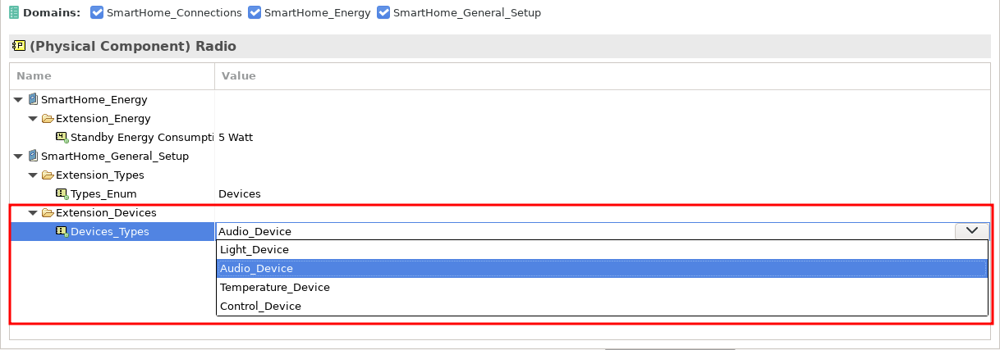

# Part 2: Extend the model

In our next step, we aim to visualise which devices handle functions like light, temperature, and music. Imagine how useful it would be to visualise this directly within the physical architecture! In Capella, you can manually define the visualization for each model element, tailoring each one individually to meet your needs. However, when dealing with larger models, this process becomes extremely time-consuming and cumbersome. Not only does it take a significant amount of effort, but it also becomes impractical to establish and manage consistent rules for specific element types, such as physical components or logical functions. This lack of clear, manageable visualization rules can lead to inconsistencies and make your model harder to understand and maintain. By streamlining and automating this process, you can ensure a more cohesive and efficient modeling experience.

This is where the Property-Value Management Tool (PVMT) extension comes in. With the PVMT we can add customised values in Capella model elements. Imagine it as a plugin for Capella that not only simplifies the process but also consolidates everything into a single, easy-to-manage system. This extension adds comfort and efficiency, making your customisation tasks smoother and more streamlined. By integrating these functionalities into a clear visual model, we can better understand the interplay between different components and their roles in our system. This approach not only enhances our comprehension but also support the design and analysis processes and it gets extremely helpful in large systems.

While designing the smart home system for your dining room, you realise it's missing one essential element: a radio to listen to some cool jazz while having dinner. This device hasn't been added to your Capella model yet. Bring this idea to life by creating a physical component (<CaIcon name="physicalComponent" />) named "Radio" and placing it in the dining room. After adding the component, it’s time to head over to the Property Values menu and assign it a Device_Type of "Audio Device." To do this, simply click on the value in the Property Values view. A drop-down menu will appear, allowing you to choose the correct entry. It’s as easy as that! Just pick Audio Device from the list.

Keep in mind, if there are multiple custom values, you might need to scroll down a bit to find the right option. Don’t worry, just take a look at the image below for reference:

Important note on exercises:

Saving your Capella model is usually unnecessary, as an automated model checker verifies whether you've completed the tasks. However, it's a good idea to save your progress periodically to ensure your work is preserved. If the automated model checker fails to function, you can manually save your model by clicking the "Save All" button (<CaIcon name="saveAll" />).

