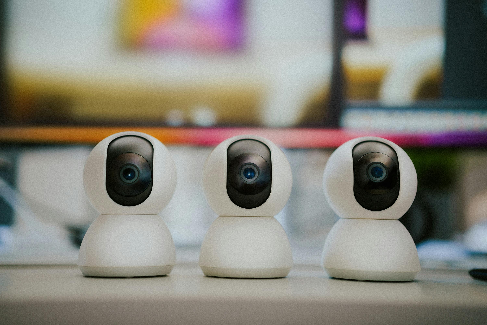

# Part 1

Welcome to the second chapter! In the first chapter, we explored the benefits of Property Value Management in Capella. Now, we’re ready to take it a step further by guiding you through the process of creating and configuring a similar approach from scratch. Don’t worry—we’ll continue using the familiar smart home example, so you can easily follow along.

You’re already happy with your Smart Home System, especially since you’ve managed to reduce energy consumption. Now, you’re thinking of enhancing it by adding new security features. To achieve this, you’ll need to expand your logical architecture to include these updates.

You’ve already made some adjustments to your architecture in the Capella model. Let’s dive deeper into the logical architecture and start adding more functionality.

Begin by locating and opening your Logical Architecture Diagram to get a clear view of your current setup. You’ll notice that several logical components, functions, and exchanges are already established. Now, let’s add an exciting new feature to your video surveillance system: a motion-activated camera that only turns on when movement is detected, helping conserve energy and making your system even smarter.

To add the missing functionality, start by creating a new logical component named "Motion Detection System" and place it within the existing the logical component "Video Surveillance System". Next, create a new logical function named "Detect motion" within this component. This function will handle the identification of objects, people, vehicles, and other important movements. Next, create a functional exchange between the new logical function "Detect motion" and the existing "Activate camera" function. Name this exchange "Motion detect trigger." This will allow the camera to activate only when motion is detected.

