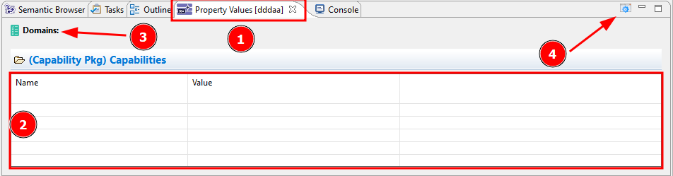
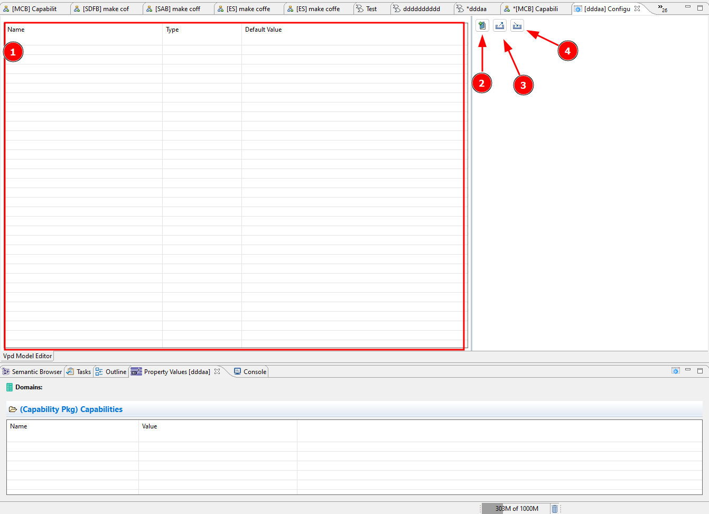

Let’s work together to create a new Property Value Management Configuration File from scratch.

Here’s what you need to know:

- Understanding PV Configuration Files:
  - PV configuration files contain all the necessary definitions for managing properties.
  - By default, each project automatically includes a PV configuration file.
  - PV configuration files can also be saved separately and used across multiple projects. We’ll explore this in more detail in the Advanced section (refer to another chapter).
- Accessing and Configuring the PV File:
  - To access the PV File, go to the "Property Values" tab (1).
  - If the view isn’t visible, you can enable it by navigating to Window > Show View > Other > Property Values or search "property values" it via the search icon (<CaIcon name="search"/>)
  - Initially, the PV File will be empty (2), with no domains assigned (3).
  - You can configure the file using the gear icon (<CaIcon name="openCurrentConfigFile"/>) in the top-right corner (4).

Let's get started on setting up your new PV sheet! To start, please open the PV configuration file over the gear icon in the top-right corner (4)

You’ll encounter the following view:

**Empty Configuration Window**: This is your starting point, a blank canvas where you can build your configuration from scratch (1)

**Create a New Domain (<CaIcon name="newDomain" />)**: Picture a domain as a group of related properties you want to add to your model. It’s like defining the key aspects of your system (2)

**Export Configuration File (<CaIcon name="exportConfig" />)**: Once you've set up your configuration, you can save it for future use. This is your way of preserving your setup for later (3)

**Import Configuration File (<CaIcon name="importConfig" />)**: If you have a configuration from another project or source, this option allows you to easily load it into your current setup (4)

Now that you’ve grasped the core concept of PVMT, you're ready to unleash the full potential, transforming theory into action.

