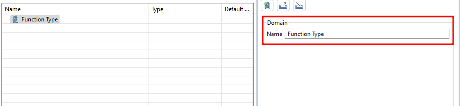

We’ll be creating various properties that we’ll add to our model and group under a domain. Therefore, first of all we need to create a domain to later be able to distinguish between the type of functions for our smart home system logical architecture.

This is how you can create a new domain and rename it:

1. Click <CaIcon name="createDomain" /> to Create a Domain
2. Rename the Domain: Click on the new domain and, in the right panel of the window, change its name

