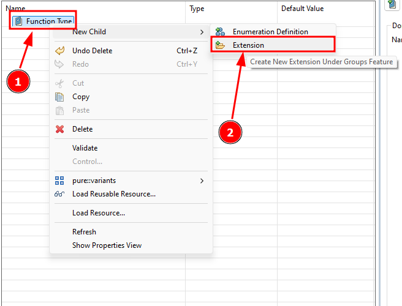
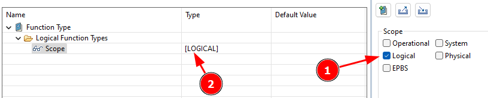

# Part 3: Create an extension

To set specific values for our example, we need to define a few more objects. Within each domain, you can create two types of objects: Enumeration Definitions and Extensions.

**Enumeration Definitions** are like custom lists of options that you can predefine and later use to categorise elements in your model. These lists make it easy to apply consistent properties across your project. We'll have an example of that in a minute.

**Extensions** define a group of properties that will be added to any model element that meets the scope criteria, for example the logical or physical layer. Important: At least one architectural layer must be selected to have a valid extension.

In this step, we’re going to categorise the functions in your logical architecture into four distinct types. By the end, we’ll visually differentiate these categories using colors, making your architecture not only functional but also easy to interpret at a glance.

Here are the four types of functions we'll define:

- **Security**: These functions are all about safeguarding your smart home. They might include tasks like motion detection, camera activation, and alarm triggering. Security functions are essential for monitoring and protecting your home environment.
- **Temperature**: Functions under this category manage the climate within your home. They control heating, cooling, and ventilation systems, ensuring your home stays comfortable and energy-efficient.
- **Light**: Light functions are responsible for controlling your lighting systems. They can include tasks like adjusting brightness, turning lights on or off based on time or occupancy, and setting mood lighting.
- **Audio**: Audio functions deal with sound systems in your smart home. This could involve managing speakers, controlling music playback, or even handling voice commands and notifications.

Of course, this is a simplification, and there could be more categories that we haven't covered yet. The beauty of the PV configuration file is its flexibility—you can always add more properties as needed.

Now, let's create a property that applies to all logical functions and provides the user with a predefined list of possible function types. This will make it easier for users to consistently categorise functions in the future. To implement this in the PV Framework, we need to create a new Extension. This extension will define the scope for the logical architecture, ensuring that our new property is applicable across all relevant functions.

To create an Extension, just follow these steps:

Right-click on the Domain (1) (<CaIcon name="domain" />) and create an Extension (2) (<CaIcon name="createExtension" />).

Give it a name: Name the Extension "Logical Function Types"

Set the Scope (<CaIcon name="scope" />) to Logical Architecture: Make sure that the extension is scoped to the logical architecture so that the property is available to all logical functions. Just tick the box for logical architecture (1) and you see that the scope changes in the table on the left as well (2). You would have to select several layers at this point if the extension should be valid and applicable for several layers in Capella.

Now it's your turn! Create a new extension for the smart home model and set the scope to the logical layer.

