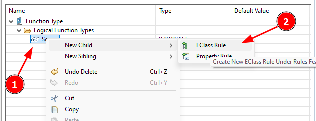
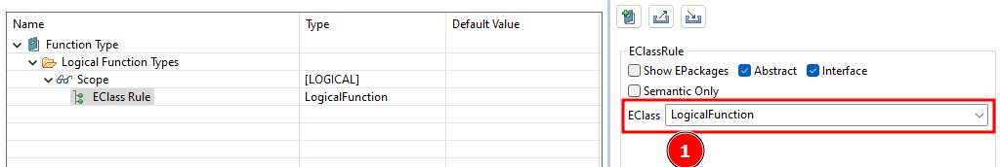

# Part 4: Create EClass Rule

Great, you created your first Extension - but we still need to do some work to make our PV configuration fully work for our purpose. Now we need to define the mechanisms used to control how properties are applied and managed within our model. These mechanisms are called Property Rule and EClass Rule.

Here’s a simple way to describe them:

**Property Rule**
- **What It Is**: A Property Rule defines specific conditions or constraints on how a property can be applied to elements within your model. It helps ensure that properties are only used in appropriate contexts.
- **Example**: Suppose you have a property called "Security Level." A Property Rule could specify that this property can only be assigned to functions categorized under "Security" domains, preventing it from being mistakenly applied to unrelated elements like "Lighting" functions.

**EClass Rule**
- **What It Is**: An EClass Rule determines which types of model elements (or "EClasses") a particular property can be attached to. EClasses in Capella represent different types of elements, like functions, components, or interfaces.
- **Example**: If you have a property like "Power Consumption," an EClass Rule might restrict this property to only be applied to physical components, ensuring that it doesn’t get applied to logical functions, functional exchanges or other non-relevant elements.

There are more options for rules than just EClass Rules, but for our example, we can keep things simple by using a basic EClass Rule. Ready to create an EClass Rule? Let’s dive right in! Here is how you can do it:

Navigate to the "Scope" (<CaIcon name="scope" />) in your model. Right-click on it to reveal a drop-down menu. Start by creating a new EClass Rule by first right-clicking on the "Scope" (1) and then select "Eclass Rule (2) (<CaIcon name="createEclassRule" />).

From the list (1), choose the type of your model object. Now, a list will appear. From this list, choose the type of model object you want to apply your rule to—maybe it’s a logical function, or something else entirely depending on your specific needs.

With just these few clicks, you've started building your own custom logic within Capella. It's that simple!

**Quick Tip: Filtering the List**

You might notice a few checkboxes that can help you filter the list and make your search faster. For this example, we won’t need them, but they become incredibly useful when working with larger models, helping you find exactly what you’re looking for.

**Pro Tip: Nesting Rules for Advanced Control**

Did you know? Property Rules and EClass Rules can actually be nested within each other. This opens up a whole new level of complexity and control in your models. Don’t worry, we’ll dive into this advanced technique in another lesson!

For our example, we just want to establish rules for a specific type of element in our model—namely, logical functions. Now it’s your turn to give it a try: create an EClass Rule and set it to apply to elements of the type "LogicalFunction."

