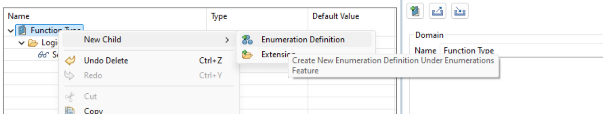
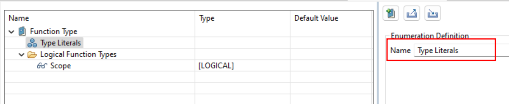
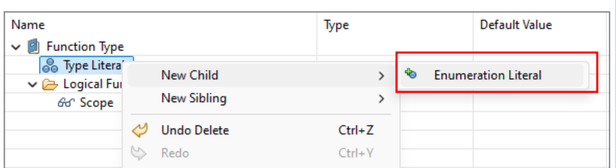
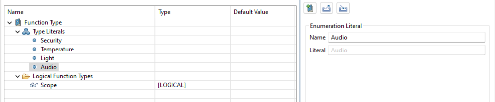

# Part 5: Create Enumeration Definition and Enumeration Literals

We’ve now laid the groundwork by defining the model element types—our logical functions—that we want to enhance with new values and properties. The exciting part is that we can establish these new values using **Enumeration Definitions**.

Enumeration Definition:
- **Enumeration Definitions** are like dropdown menus for properties. Instead of typing in a value every time, you select from a set list of options.
- **Example**: Imagine you have a property called "Safety Level" for your functions. With an enumeration definition, you can create a list of possible values like "High," "Medium," and "Low." Whenever you assign this property, you just pick one of these options from the list. Pretty cool, right?

**Here is how you can create an Enumeration Definition:**

Right-click on the domain (<CaIcon name="domain" />) and select the option to create an Enumeration Definition (<CaIcon name="createEnumerationDefinition" />). Then give it a name!

We’ve now defined the model element types (Logical Functions) for which we want to create new properties. To categorize these functions, we’ll use **Enumeration Definitions** to set up specific values. Let’s create an Enumeration Definition for our Smart Home System that will allow us to classify our logical functions into the categories: **Security**, **Temperature**, **Light**, and **Audio**. We already started by creating an Enumeration Definition which will group these categories.

Your turn! Go ahead and create a new Enumeration Definition and name it "Type Literals".

Then, create some Enumeration Literals for each category!

- Start by right-clicking on your newly created definition (<CaIcon name="enumerationDefinition" />).
- Now, one by one, create your Enumeration Literals (<CaIcon name="createEnumerationLiteral" />) each one representing a specific value you want to define in your model.
