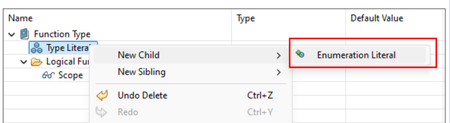
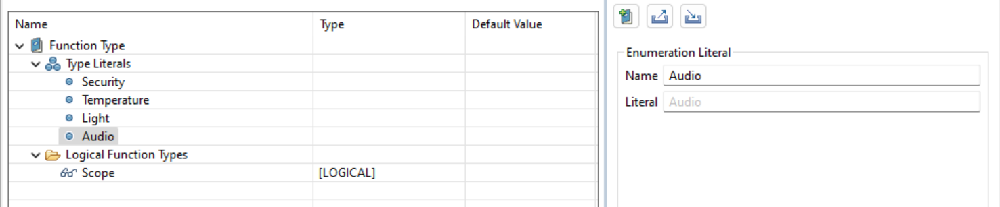

# Part 6: Create Enumeration Literals

We’ve now defined the model element types (Logical Functions) for which we want to create new properties. To categorize these functions, we’ll use **Enumeration Definitions** to set up specific values. Let’s create an Enumeration Definition for our Smart Home System that will allow us to classify our logical functions into the categories: **Security**, **Temperature**, **Light**, and **Audio**. We already started by creating an Enumeration Definition which will group these categories.

Let’s create some Enumeration Literals for each category!

Start by right-clicking on your newly created definition (<CaIcon name="enumerationDefinition" />).
Now, one by one, create your Enumeration Literals (<CaIcon name="createEnumerationLiteral" />) each one representing a specific value you want to define in your model.

