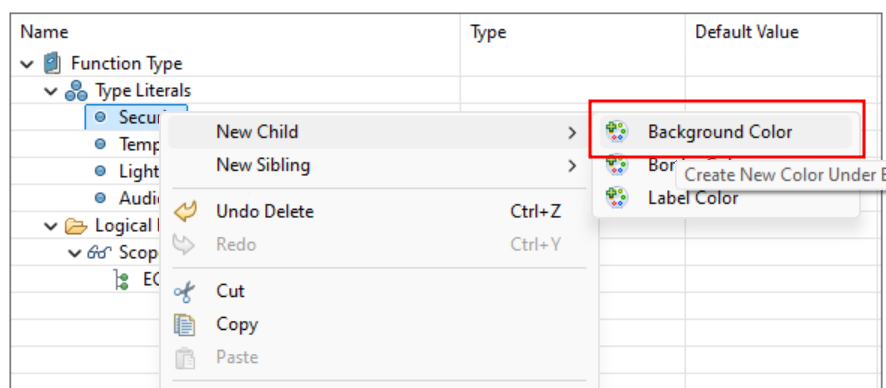
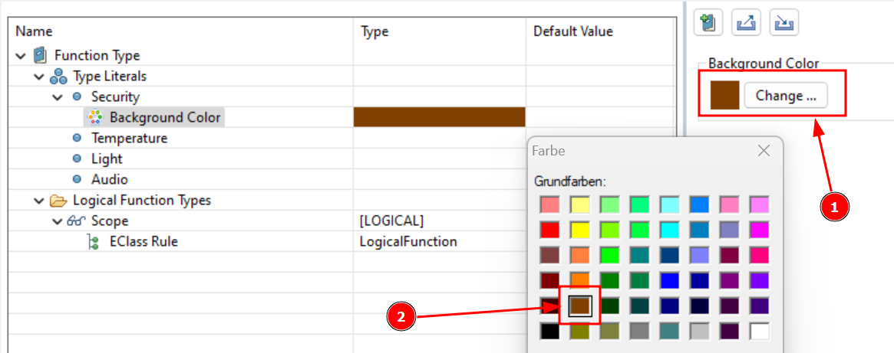

# Part 7: Create Color Coding Property

Now it’s getting exciting! We’re going to define different colors for each type of function to visually distinguish and organize elements in your model more effectively.

We can do this by setting **Background**, **Border**, and **Label Colors** for each Enumeration Literal. Each category—like Security, Temperature, Light, and Audio—can have its own unique color scheme. These colors will automatically apply to the function blocks in your diagrams, making it easy to spot which functions belong to which category at a glance. And don’t worry, if you decide later that you want to change these colours, you can easily adjust them.

- **Background Color**: This is the colour that fills the entire area behind an element. It helps visually differentiate different types of elements or highlight specific properties.
- **Border Color**: The colour of the outline around an element. Changing the border colour can make certain elements stand out more or indicate a particular category or status.
- **Label Color**: This refers to the color of the text label associated with an element. Customizing the label colour can improve readability or be used to match the element's type or function.

**This is how you can define the Background Colors:**
- Right-click on each **Enumeration Literal** (<CaIcon name="enumerationLiteral" />).
- Select "**New Child**" and choose "**Background Color**" (<CaIcon name="createBackgroundColor" />) from the available options.
- Now for the fun part. Select "Change" (1) and pick a color that suits your model’s style! (2)

With just a few clicks, you’ve personalised your elements, making them easier to identify and more visually appealing.

Now, let’s bring some colour into our model by setting background colours for each category. This will make it super easy to identify different function types at a glance:

| Type        | Colour | Hex     |
|-------------|--------|---------|
| Security    | Brown  | #C86B03 |
| Temperature | Red    | #FF5050 |
| Light       | Yellow | #FFFE60 |
| Audio       | Blue   | #4084BF |