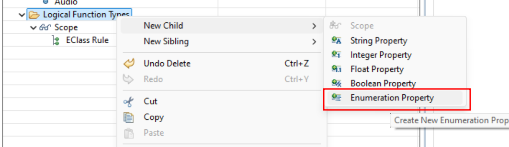
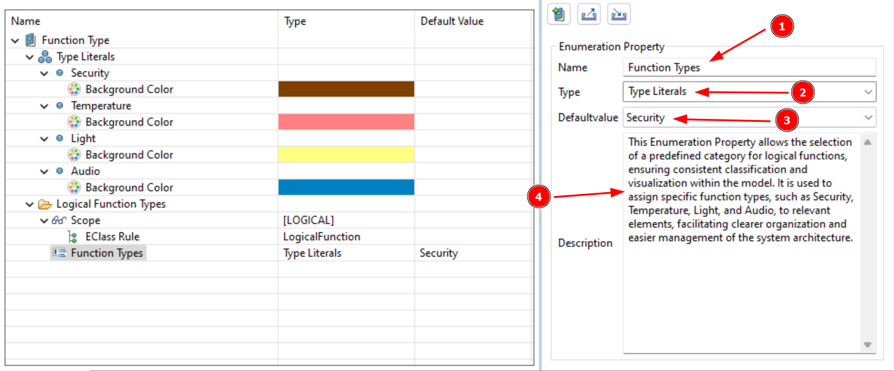

# Part 8: Create Enumeration Property

Now it’s time to put our definitions to work by linking the Enumeration Definition to our Extension through an **Enumeration Property**. Without this step, our Enumeration Definition would just be sitting there unused. Here’s how it works: Enumeration Definitions are created separately and aren’t automatically connected to any Extension. To make them functional, we need to explicitly link them through an Enumeration Property.

The cool thing is that Enumeration Definitions can be used in one or multiple Enumeration Properties, and those properties can be applied across one or more Extensions. Let’s walk through creating an Enumeration Property that ties together everything we’ve set up so far!

**Create an Enumeration Property:** Navigate to your Extension (<CaIcon name="extension" />), right-click, and select "Create Enumeration Property" (<CaIcon name="createEnumerationProperty" />). This will allow us to define categories for our model elements.

**Name the Enumeration Property**: Give it a clear and meaningful name (1) - so you can easily identify what it represents in your model.

**Link the Enumeration Definition**: Now, let’s connect the **Enumeration Definition** we created earlier. In the "**Type**" dropdown (2), select the Enumeration Definition. This ensures our property has the right categories to choose from.

**Set the Default Value**: Set the default value (3). This means that unless otherwise specified, functions will initially be categorized under this default value.

**Add a Description**: Don’t forget to include a description (4) that explains what this Enumeration Property (<CaIcon name="enumerationProperty" />) is for. This will help others (and your future self!) understand its purpose at a glance.

Now its your  turn: create an enumeration Property named "Function Types" and link it to the earlier created Enumeration Definition. Set the default value to Security.

